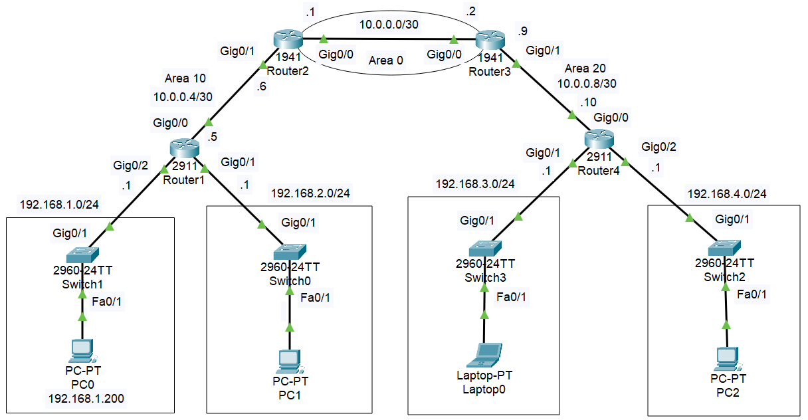

# 🌐 Infraestructura de Red Segura: OSPF Multi-Área y Hardening con ACLs
* Este proyecto documenta la implementación y aseguramiento de una topología de red escalable en **Cisco Packet Tracer**. Se ha diseñado una arquitectura basada en el protocolo de estado de enlace **OSPF (ID 10)** para garantizar la redundancia y eficiencia en el enrutamiento, integrada con políticas de **Listas de Control de Acceso (ACL)** para el robustecimiento del plano de gestión y de datos.
---
## 🏗️ 1. Arquitectura de Red
La red se segmenta en tres áreas lógicas para optimizar la convergencia y el control:

* **Área 0 (Backbone)**: Núcleo de tránsito de alta velocidad entre los routers de borde (R2-R3).
* **Área 10 (División Oeste)**: Gestionada por **Router1**, sirve a los segmentos LAN `192.168.1.0` y `192.168.2.0`.
* **Área 20 (División Este)**: Gestionada por **Router4**, sirve a los segmentos LAN `192.168.3.0` y `192.168.4.0`.

> 
> *Esquema lógico de la topología implementada.*
---
## 🔒 2. Implementación de Seguridad (Hardening)
### A. Control de Acceso Administrativo (VTY)
Se aplicó el principio de **privilegio mínimo** para el acceso vía Telnet, restringiendo la gestión remota únicamente a los vecinos directos:
* **Router1**: Solo autoriza a la IP `10.0.0.6` (Router2).
* **Router4**: Solo autoriza a la IP `10.0.0.9` (Router3).

### B. Filtrado de Tráfico de Datos
En el **Router4**, se implementó la ACL estándar `RESTRICCION` para salvaguardar la integridad de los activos en el Área 20:
* **Filtro selectivo**: Bloqueo del host crítico `192.168.1.200`.
* **Aislamiento de red**: Denegación total del tráfico proveniente del segmento `192.168.2.0/24`.
---

## 📊 3. Matriz de Direccionamiento
| Dispositivo | Interfaz | Dirección IP | Prefijo | Función |
| :--- | :--- | :--- | :--- | :--- |
| **Router1** | Gig0/0 | 10.0.0.5 | /30 | Enlace Wan (Área 10) |
| **Router2** | Gig0/1 | 10.0.0.6 | /30 | Vecino Autorizado |
| **Router3** | Gig0/1 | 10.0.0.9 | /30 | Vecino Autorizado |
| **Router4** | Gig0/0 | 10.0.0.10 | /30 | Enlace Wan (Área 20) |

---

## 🛠️ 4. Pruebas de Validación
Para confirmar la efectividad de las ACLs, se realizaron pruebas de estrés en la terminal:

```bash
# Intento de acceso no autorizado desde PC2 hacia Router4
PC2> telnet 10.0.0.10
Trying 10.0.0.10 ...
% Connection refused by remote host
```
## Tabla de direccionamiento
En la siguiente tabla se muestra el direccionamiento de interfaces por dispositivo usado en nuestra topologia
| Dispositivo | Interfaz | Dirección IP | Máscara | Propósito / Área |
| :--- | :--- | :--- | :--- | :--- |
| **Router1** | Gig0/0 | 10.0.0.5 | /30 | Enlace a Router2 (Área 10) |
| | Gig0/1 | 192.168.2.1 | /24 | Gateway LAN 192.168.2.0 |
| | Gig0/2 | 192.168.1.1 | /24 | Gateway LAN 192.168.1.0 |
| **Router2** | Gig0/0 | 10.0.0.1 | /30 | Enlace a Router3 (Backbone Área 0) |
| | Gig0/1 | 10.0.0.6 | /30 | Enlace a Router1 (Área 10) |
| **Router3** | Gig0/0 | 10.0.0.2 | /30 | Enlace a Router2 (Backbone Área 0) |
| | Gig0/1 | 10.0.0.9 | /30 | Enlace a Router4 (Área 20) |
| **Router4** | Gig0/0 | 10.0.0.10 | /30 | Enlace a Router3 (Área 20) |
| | Gig0/1 | 192.168.3.1 | /24 | Gateway LAN 192.168.3.0 |
| | Gig0/2 | 192.168.4.1 | /24 | Gateway LAN 192.168.4.0 |

## 🚀 5. Escalabilidad y Proyecciones de Ingeniería
Este diseño ha sido concebido bajo una arquitectura modular que permite una evolución **ineludible** hacia estándares de próxima generación:
### A. Migración a Infraestructura de Fibra Óptica (GPON/FTTH)
Dada la segmentación por áreas (10, 0 y 20), la topología facilita la transición de enlaces de cobre a **Fibra Óptica**. 
* **Escalado**: La implementación de redes **GPON** permitiría manejar ratios de splitting elevados para dar servicio a una mayor densidad de usuarios en las áreas de acceso, manteniendo el núcleo **OSPF** como backbone de alta velocidad.
### B. Transición a IPv6 Dual-Stack
La matriz de direccionamiento actual en IPv4 puede evolucionar hacia un esquema **Dual-Stack**. 
* **Beneficio**: Permitiría asignar prefijos globales a cada segmento LAN sin necesidad de NAT, simplificando la trazabilidad de las **ACLs** a nivel de host global.
## 6. Explicación de medidas tomadas para la implementación
### ¿Por qué Telnet y no otro protocolo?
La implementación de **Telnet** (Puerto 23) se define bajo un marco estrictamente académico para validar la capacidad de filtrado de paquetes TCP. Su uso permite demostrar cómo las **ACLs** pueden interceptar peticiones de gestión en el plano de control de manera eficaz.
### Criterio de Ubicación de ACLs
Se ha determinado aplicar las listas de acceso en el **Router Destino** (Final) bajo la siguiente lógica de ingeniería:
1. **Seguridad VTY**: El comando `access-class` actúa como un firewall específico para las líneas virtuales del router, por lo que su aplicación es intrínseca al dispositivo que se custodia.
2. **Validación de Adyacencia**: Al filtrar en el destino, el router puede discernir con precisión si la IP de origen corresponde a su vecino directo autorizado, cumpliendo con la directiva de seguridad de "Vecino Directamente Conectado".
